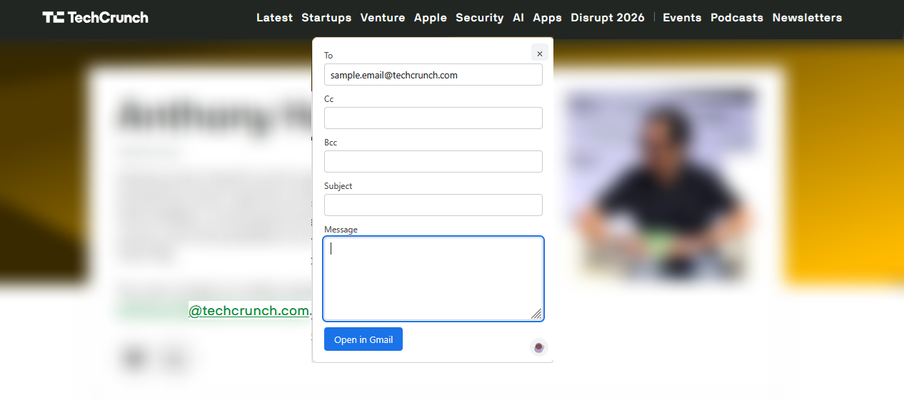

# Mailto Inside

Mailto Inside intercepts `mailto:` links on any page and replaces the browser's
native handler with a small in-page compose form. When you hit send, it opens
a pre-filled Gmail draft in a new tab — no OAuth, no API keys, and nothing is
ever transmitted by the extension itself.

|  |  |
|---|---|
| **Screenshot 1** | _Compose form appearing after a mailto link is clicked_ |
|  | |


## Why

Clicking a `mailto:` link on a page that isn't your default mail client
usually triggers an "open with…" dialog, or silently does nothing. Mailto
Inside intercepts the click, shows a lightweight compose form right on the
page, and hands the finished message to Gmail's own web compose URL — so you
finish and send from an already-authenticated Gmail tab.

## Features

- Intercepts `mailto:` links anywhere on the page, including `to`, `cc`,
  `bcc`, `subject`, and `body` parameters
- Small, dismissible compose form positioned near the click
- Opens a pre-filled Gmail compose draft in a new tab on submit
- On/off toggle from the toolbar popup
- No OAuth, no Gmail API, no host permissions beyond the content script
  itself — the extension never reads or transmits your email data

## Privacy

Mailto Inside does not collect, store, or transmit any data. The only
storage used is `chrome.storage.local` (or the Firefox equivalent), holding a
single on/off boolean for the popup toggle. Composing and sending happens
entirely in Gmail's own web interface once the draft link is opened.

## Install

### Chrome / Edge

1. Download the latest `mailto-to-gmail-chrome.zip` from [Releases](../../releases)
   and unzip it, or clone the repo and use the `dist/chrome/` folder
2. Go to `chrome://extensions` (or `edge://extensions`)
3. Enable **Developer mode**
4. Click **Load unpacked** and select the unzipped folder

### Firefox

1. Download `mailto-to-gmail-firefox.zip` from [Releases](../../releases) and
   unzip it, or use the `dist/firefox/` folder
2. Go to `about:debugging#/runtime/this-firefox`
3. Click **Load Temporary Add-on…** and select `manifest.json` inside the
   folder

Temporary add-ons in Firefox are removed on restart. For a permanent
install, the same zip can be submitted to
[addons.mozilla.org](https://addons.mozilla.org) for signing (listed or
self-distributed).

## Repository structure

```
mailto-inside/
├── src/
│   ├── content.js       # mailto interception, compose form, Gmail hand-off
│   ├── content.css      # scoped styles for the injected form
│   ├── popup.html        # toolbar popup (on/off toggle)
│   ├── popup.js
│   └── icons/
│       ├── icon16.png
│       ├── icon32.png
│       ├── icon48.png
│       └── icon128.png
├── manifest.chrome.json  # also used for Edge
├── manifest.firefox.json
├── build.sh
└── dist/                 # build output, git-ignored
    ├── chrome/
    └── firefox/
```

## Building

```bash
./build.sh
```

This copies `src/` into `dist/chrome/` and `dist/firefox/`, drops in the
matching manifest as `manifest.json`, and produces a submission-ready zip for
each (with `manifest.json` at the zip root, as required by the Chrome Web
Store and AMO).

## Permissions explained

| Permission | Why |
|---|---|
| `storage` | Persists the popup's on/off toggle locally |
| `content_scripts` matching `<all_urls>` | Needed to detect `mailto:` clicks on any site — no network requests are made from the content script itself |

## Known limitations

- `file://` pages require enabling "Allow access to file URLs" for the
  extension (Chrome/Edge) or an equivalent local-file permission (Firefox)
- The send step happens in a new Gmail tab rather than in-page, since the
  extension does not use the Gmail API

## License

Add a license of your choice (e.g. MIT) here before publishing.
